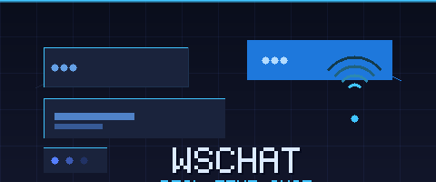

<div align="center">
  

  [](https://nodejs.org/)
  [](https://socket.io/)
  [](https://expressjs.com/)
  [](LICENSE)

  **💬 Real-time chat with typing indicators, live user count, and XSS protection — one `npm start` away 🔌**

</div>

---

## ✨ Features

- ⚡ **Instant messaging** — zero-latency delivery via WebSocket (no polling)
- 🟢 **Live user count** — see how many people are in the room in real time
- ✍️ **Typing indicator** — broadcast to all connected users when someone is typing
- 📣 **Join / leave notifications** — the room announces when users connect or disconnect
- 🛡️ **XSS protection** — all messages are HTML-encoded with [`ent`](https://www.npmjs.com/package/ent) before broadcast

## 🚀 Quick Start

```bash
npm install
npm start
```

Open `http://localhost:3000`, enter a username, and start chatting. Open a second tab to see real-time sync in action.

**Development (hot reload):**

```bash
npm run dev
```

## 🏗️ How it works

```
Browser (Socket.IO client)  ←→  Express server  ←→  All connected browsers
       ↑                              ↑
  chat.js (public/)            index.js (server)
```

The server keeps a `userData` map of `socket.id → username`. On each event, it does the following:

| Event | Action |
|---|---|
| `Newconnection` | Registers username, broadcasts join notification |
| `chat` | HTML-encodes the message, broadcasts to all |
| `typing` | Forwards the event to all other sockets |
| `disconnect` | Removes user from map, broadcasts leave notification |

## 🛠️ Tech Stack

- **Node.js** + **Express** — static file serving and HTTP server
- **Socket.IO v2** — WebSocket abstraction with fallback
- **`ent`** — HTML entity encoding (XSS protection)
- **nodemon** — dev hot reload
